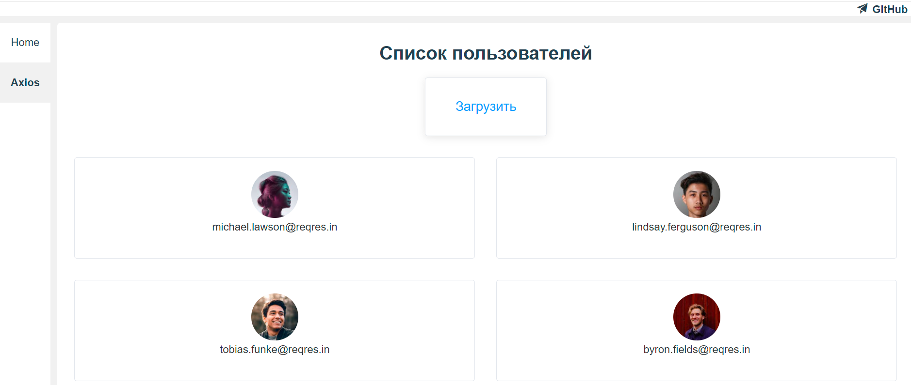
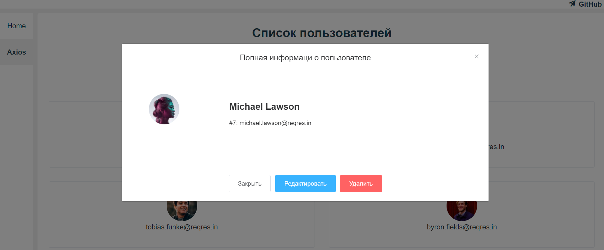

### Задание
1. Получение коллекции пользователей с URL-адреса https://reqres.in/api/users?page=2
2. Обработка ответа с сервера и валидация полученной коллекции
3. Сохранение коллекции пользователей в LocalStorage
4. Отображение пользователей из LocalStorage в список в виде карточек
5. При нажатии на элемент списка – показывать в диалоговом окне подробную информацию по выбранному пользователю
6. Редактирование данных отдельного пользователя (только в LocalStorage)
7. Удаление пользователей (только из LocalStorage)
8. Обновление списка пользователей с сервера


####Будет плюсом:
• Unit-тесты

• Логирование выполненных операций

• Анимация пользовательских представлений

---
### ТЕХНОЛОГИЧЕСКИЙ СТЕК
### Vite 2.x + Vue 3.x + TypeScript
- [TypeScript 4.x](https://www.typescriptlang.org/zh/) + [JavaScript](https://www.javascript.com/)
- [Vite 2.x](https://cn.vitejs.dev/)
- [Vue 3.x](https://v3.cn.vuejs.org/)
- [Vue Router 4.x](https://next.router.vuejs.org/zh/index.html)
- [Vuex 4.x](https://next.vuex.vuejs.org/)
- [Element Plus](https://element-plus.org/#/zh-CN)
- [Stylus](https://stylus-lang.com/) / [Sass](https://sass.bootcss.com/documentation) / [Less](http://lesscss.cn/)
- [Axios](https://axios-http.com/)
- [EditorConfig](http://editorconfig.org) + [Prettier](https://prettier.io/) + [ESLint](https://eslint.org/) + [Airbnb JavaScript Style Guide](https://github.com/airbnb/javascript#translation)

---
### Команды для запуска проекта 
```sh
npm install
```

```sh
npm run dev
```

---

###Просмотр резултата
```sh
http://localhost:3000/#/axios
```



